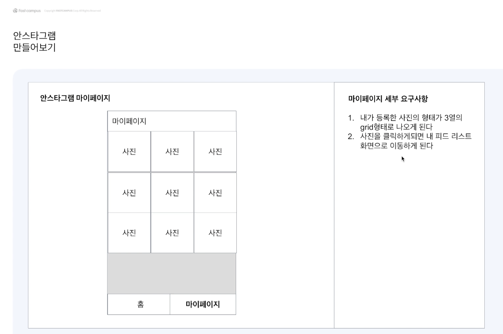
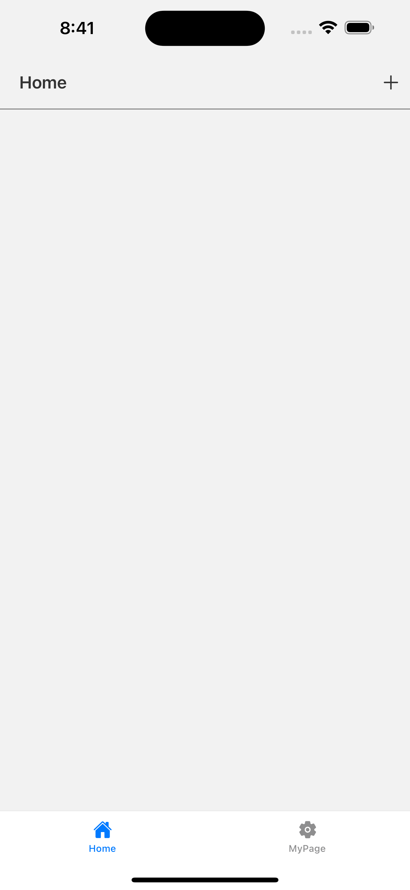
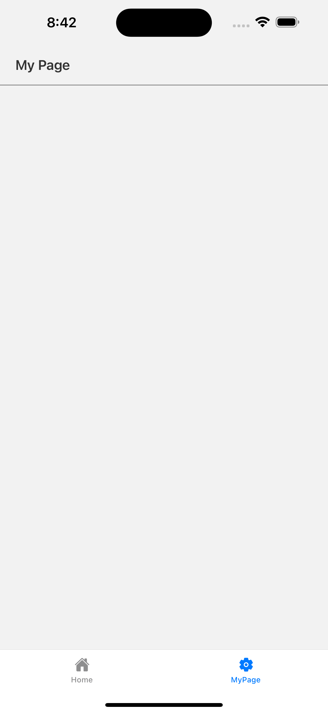
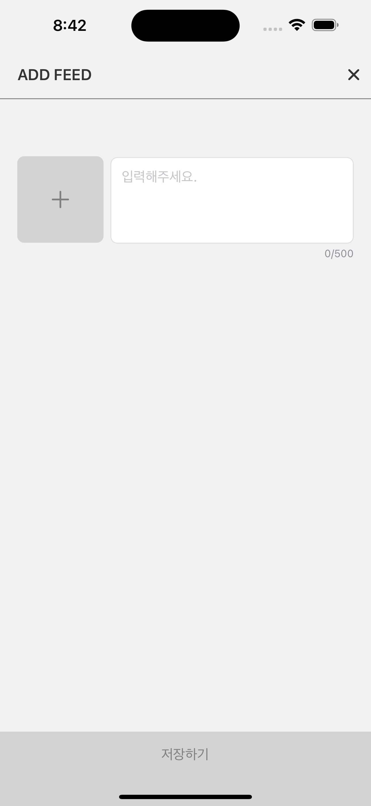
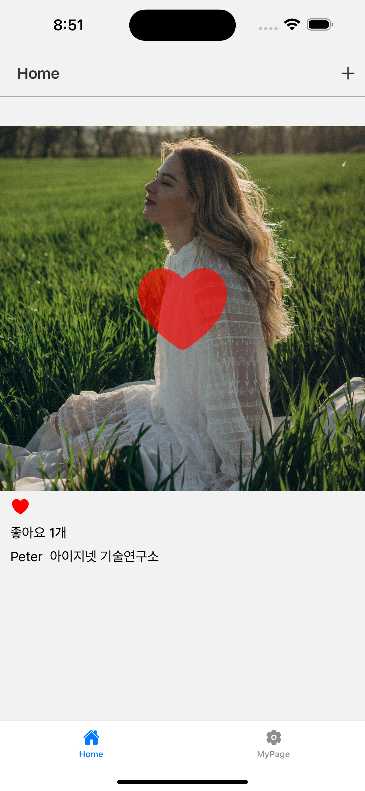
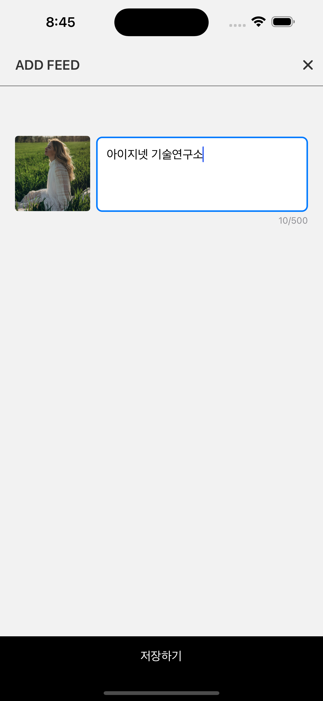
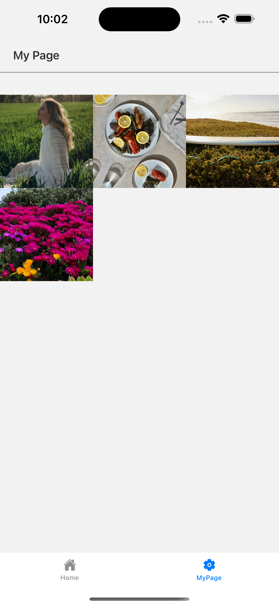

# Anstargram

안스타그램 클론 앱으로 Expo를 활용한 소셜 미디어 애플리케이션입니다.

## 요구사항



## 화면
|HOME(Feed)|MyPage|ADD FEED|FEED LIST|
|-|-|-|-|
|||||

## 주요 기술 스택

### 프레임워크 & 라이브러리
- **Expo** - React Native 개발 플랫폼
- **React Native New Architecture** - 새로운 아키텍처 활성화
- **React Navigation** - 네비게이션 라이브러리

### 상태 관리
- **React Redux** - 전역상태관리
- **Redux Toolkit** - Redux 개발 도구
- **Redux Thunk** - 비동기 액션 처리
- **Redux Logger** - 상태 변화 로깅

### UI/UX
- **Expo Image Picker** - 이미지 선택
- **React Native Safe Area Context** - 안전 영역 처리

### 백엔드(serverless) - 시도 했으나 버전 호환성 문제로 미사용( or NA 호환 문제)
- Firebase 연동 시도
  - app, auth, db
- Google Sign-In 시도
- 문제를 해결에 1md 이상 지속되어 포기 함
  -  강의 시청으로 학습을 대체 함

## 주요 기능

### 홈 화면
- 피드 목록 조회
- 좋아요, 좋아요 취소 기능



- 로직(좋아요 - Redux, Redux-Thunk)

```ts
const favoriteFeed =
  (item: FeedInfo): TypeFeedListThunkAction =>
  async (
    dispatch: ThunkDispatch<RootReducer, undefined, TypeFeedListThunkActions>,
    getState: () => RootReducer
  ) => {
    dispatch(favoriteFeedRequest());

    const myId = getState().userInfo.userInfo?.uid || null;
    // if (myId === item.writer.uid) {
    //   dispatch(favoriteFeedFailure());
    //   return;
    // }

    await sleep(500);
    const hasMyId =
      item.likeHistory.filter((likeUserId) => likeUserId === myId).length > 0;
    if (hasMyId) {
      // 좋아요 취소
      dispatch(favoriteFeedSuccess(item.id, myId || "", "del"));
    } else {
      // 좋아요 추가
      dispatch(favoriteFeedSuccess(item.id, myId || "", "add"));
    }
  };

```


### 피드 작성

- 이미지 선택 ~~및 업로드~~
- 텍스트 입력
- 피드 저장(상태)



- 로직(Redux, Redux-Thunk)

```ts
const createFeed =
  (
    item: Omit<FeedInfo, "likeHistory" | "createdAt">
  ): TypeFeedListThunkAction =>
  async (
    dispatch: ThunkDispatch<RootReducer, undefined, TypeFeedListThunkActions>,
    getState: () => RootReducer
  ) => {
    const userInfo = getState().userInfo.userInfo;
    dispatch(createFeedRequest());

    await sleep(1000); // 업로드, firebase

    const newItem: FeedInfo = {
      id: item.id,
      writer: {
        name: userInfo?.name ?? "Unknown",
        uid: userInfo?.uid ?? "Unknown",
      },
      content: item.content,
      createdAt: dayjs().valueOf().toString(),
      likeHistory: [],
      imageUrl: item.imageUrl,
    };

    dispatch(createFeedSuccess(newItem));
  };
```


### 마이페이지
- 사용자 정보 표시
- 내가 작성한 피드 그리드 뷰(3열)
- 피드 목록으로 이동



- 로직(데이터 로드와 이동)

  ```ts
  const useMyPage = () => {
    // const data = useMyFeedList();
    const totalData = useTotalFeedList();
    const rootNavigation = useRootStackNavigation();
    const { width } = useWindowDimensions();
    const dispatch = useDispatch<TypeUserDispatch>();
    const photoSize = useMemo(() => width / 3, [width]);
  
    const navigateToFeedList = useCallback((params: FeedInfo[]) => {
      rootNavigation?.navigate("FeedList", { list: params });
    }, [rootNavigation]);
  
    useEffect(() => {
      // dispatch(getMyFeedList());
    }, [dispatch]);
  
    return {
      totalData,
      photoSize,
      dispatch,
      navigateToFeedList,
    };
  };
  
  ```

  

### 피드 목록
- 개인 피드
- 좋아요/좋아요 취소 기능


- 로직

```ts
const useFeedList = () => {
  const route = useRootRoute<"FeedList">();
  const data = route.params.list;
  const navigation = useRootStackNavigation<"FeedList">();
  const dispatch = useDispatch<TypeFeedListDispatch>();
  const navigateToBack = useCallback(() => {
    navigation.goBack();
  }, [navigation]);

  const navigateToFeed = useCallback((item: FeedInfo) => {
    //   navigation.navigate("AddFeed", { item });
  }, []);
  const onPressFavorite = useCallback(
    (item: FeedInfo) => {
      dispatch(favoriteFeed(item));
    },
    [dispatch]
  );
  return {
    data,
    navigateToBack,
    navigateToFeed,
    onPressFavorite,
  };
};
```


## 프로젝트 구조

```
app/
├── _layout.tsx                 # 루트 레이아웃
├── src/
│   ├── @types/                 # TypeScript 타입 정의
│   │   ├── FeedInfo.ts
│   │   └── UserInfo.ts
│   ├── actions/                # Redux 액션
│   │   ├── feed.ts
│   │   └── user.ts
│   ├── components/              # 재사용 가능한 컴포넌트
│   │   └── FeedListItem.tsx
│   ├── data/                   # 상수 데이터
│   │   └── constants.ts
│   ├── designsystem/           # 디자인 시스템
│   │   ├── Badge.tsx
│   │   ├── Button.tsx
│   │   ├── Divider.tsx
│   │   ├── DoubleTabButton.tsx
│   │   ├── Header.tsx
│   │   ├── Icons.tsx
│   │   ├── LocalImage.tsx
│   │   ├── MultiLineInput.tsx
│   │   ├── RemoteImage.tsx
│   │   ├── Spacer.tsx
│   │   ├── TabIcon.tsx
│   │   └── Typography.tsx
│   ├── hooks/                  # 커스텀 훅
│   │   ├── useAddFeed.ts
│   │   ├── useBottomTabNavigation.ts
│   │   ├── useFeedList.ts
│   │   ├── useFeedListItem.ts
│   │   ├── useHome.ts
│   │   └── useMyPage.tsx
│   ├── navigations/            # 네비게이션 설정
│   │   ├── BottomTabNavigation.tsx
│   │   └── RootStackNavigation.tsx
│   ├── reducers/               # Redux 리듀서
│   │   ├── feedList.ts
│   │   └── userInfo.ts
│   ├── screens/                # 화면 컴포넌트
│   │   ├── AddFeedScreen.tsx
│   │   ├── FeedListScreen.tsx
│   │   ├── HomeScreen.tsx
│   │   └── MyPageScreen.tsx
│   ├── selectors/              # Redux 셀렉터
│   │   ├── feed.ts
│   │   └── user.ts
│   ├── splash/                 # 스플래시 화면
│   │   └── SplashView.tsx
│   ├── store.ts                # Redux 스토어 설정
│   ├── RootApp.tsx             # 루트 앱 컴포넌트
│   └── utils/                  # 유틸리티 함수
│       └── sleep.ts
└── app.json                    # Expo 설정
```

## 개발 경험

### 학습한 기술들
- Expo를 활용한 크로스 플랫폼 개발
- Redux를 통한 복잡한 상태 관리
- 커스텀 훅을 통한 로직 분리
- Spacer 컴포넌트 활용
  - 간격 관리를 위한 Spacer 컴포넌트 사용 (margin/padding 대신). 
  - SwiftUI의 Spacer, Android Compose의 Spacer와 유사한 개념으로, 
  - 스타일 속성에서 간격을 찾아야 하는 번거로움 대신 한 눈에 간격을 파악할 수 있는 장점이 있음 
  - 렌더링 성능에 큰 영향을 주지 않는 범위에서 개발 편의성을 고려한 선택

## 새로 배운 개념

### Redux Thunk
- **역할**: 액션 크리에이터에서 비동기 로직(네트워크 요청, 지연 등)을 다룰 수 있게 해주는 미들웨어. 동기 액션만 보낼 수 있는 Redux에 함수 형태의 액션을 허용해, 내부에서 `dispatch`, `getState`에 접근 가능.
- **패턴**: 요청 시작 → 성공/실패로 액션을 분기해 로딩/데이터/에러 상태를 일관되게 관리.

```ts
// 예시: 피드 목록 가져오기 Thunk
const getFeedList =
  (): TypeFeedListThunkAction =>
  async (
    dispatch: ThunkDispatch<RootReducer, undefined, TypeFeedListThunkActions>
  ) => {
    dispatch(getFeedListRequest());

    await sleep(500); // TODO 네트워킹 구간

    dispatch(getFeedListSuccess(useTotalFeedList())); // 네트워킹으로부터 받은 데이터 설정
  };
```


### item: Omit<FeedInfo, "likeHistory" | "createdAt">

- **의미**: TypeScript의 `Omit<T, K>`를 사용해 `FeedInfo` 타입에서 `likeHistory`, `createdAt` 두 속성을 제외한 타입을 생성.
- **활용**: 생성/수정 시 불필요하거나 서버가 생성하는 필드를 제외해, 입력 모델을 더 안전하게 정의.

```ts
type FeedCreateInput = Omit<FeedInfo, "likeHistory" | "createdAt">;
const item: FeedCreateInput = {
  // FeedInfo에서 필요한 필드만 포함
};
```

### 더블탭 로직 구현 (라이브러리 없이 직접)
- **배경**: 강의는 더블탭을 라이브러리로 처리했으나, 본 프로젝트에서는 직접 구현.
- **아이디어**: 마지막 탭 시각을 저장하고, 일정 임계값(예: 250ms) 내에 두 번째 탭이면 더블탭으로 판단.

```tsx
const DoubleTap = ({
  onDoubleTap,
  delay = 250,
  children,
}: DoubleTapProps) => {
  const lastTapRef = useRef<number>(0);

  return (
    <Pressable
      onPress={() => {
        const now = Date.now();
        if (now - lastTapRef.current < delay) {
          onDoubleTap();
        }
        lastTapRef.current = now;
      }}
    >
      {children}
    </Pressable>
  );
}
```

### feedId: FeedInfo["id"]
- **의미**: TypeScript **인덱싱 접근 타입(Index Access Type)**. `FeedInfo` 타입의 `id` 속성과 동일한 타입을 참조
- **장점**: 모델이 바뀌면 참조 타입도 자동으로 따라가 타입 불일치/하드코딩을 방지.

### == vs === (JavaScript/TypeScript 비교 연산자)
- **== (느슨한 비교)**: 타입 변환 후 비교. 예상치 못한 결과가 나올 수 있음
- **=== (엄격한 비교)**: 타입과 값 모두 정확히 일치해야 true. 안전하고 예측 가능

```js
// == (느슨한 비교) - 타입 변환 발생
"5" == 5;        // true (문자열 "5"가 숫자 5로 변환)
0 == false;      // true (false가 0으로 변환)
null == undefined; // true (둘 다 falsy)

// === (엄격한 비교) - 타입과 값 모두 일치해야 함
"5" === 5;       // false (문자열 vs 숫자)
0 === false;     // false (숫자 vs 불린)
null === undefined; // false (null vs undefined)

// 실제 사용 예시
const userId = "123";
if (userId === 123) {  // false - 타입이 다름
  // 실행되지 않음
}

if (userId == 123) {   // true - 타입 변환으로 비교
  // 실행됨 (예상치 못한 동작 가능)
}
```

**권장사항**: 항상 `===` 사용. 타입 안전성과 예측 가능한 동작을 위해.

### == (느슨한 비교)를 왜 만들었을까?
- **JavaScript 설계 철학**: 동적 타입 언어의 "유연성 우선" 원칙
- **웹 환경의 특성**: HTML 폼에서 오는 값들이 모두 문자열이므로 자동 타입 변환이 편리
- **개발자 편의성**: 타입 변환을 자동으로 처리해 개발자가 신경 쓰지 않게 함

```js
// 1995년 웹 환경에서의 실제 사용 사례
const userAge = "25";  // HTML 폼에서 온 값
const minAge = 18;

// == 덕분에 간단하게 비교 가능
if (userAge == minAge) {  // "25" == 18 → 25 == 18 → true
  console.log("성인 인증");
}

// HTML 폼 데이터 처리
const formData = { age: "25", score: "95" };
if (formData.age == 18) {  // 자동 타입 변환으로 편리
  console.log("성인");
}
```

**현대 개발에서 === 선호 이유**:
- **타입 안전성**: TypeScript 사용으로 타입이 명확
- **예측 가능성**: 모바일 앱에서는 버그 방지가 중요  
- **성능**: 불필요한 타입 변환 오버헤드 방지
- **명시성**: 코드 의도가 명확해야 유지보수성 ↑

### 참고
MDN: https://developer.mozilla.org/ko/docs/Web/JavaScript/Guide/Equality_comparisons_and_sameness#loose_equality_using

어느 연산을 사용할지 선택하는 것은 여러분이 어떤 종류의 비교를 수행하려고 하는지에 달려있습니다. 간단히 말하자면 다음과 같습니다.

- 이중 등호(==)는 두 대상을 비교할 때 유형 변환을 수행한 뒤, IEEE 754를 준수하도록 NaN, -0, +0을 특별히 처리합니다(따라서 NaN != NaN이고 -0 == +0).
- 삼중 등호(===)는 이중 등호와 동일한 비교(NaN, -0, +0에 대한 특수 처리 포함)를 수행하지만 유형 변환은 수행하지 않습니다. 유형이 다르면 false가 반환됩니다.
- Object.is()는 NaN, -0, +0에 대한 형식 변환과 특수 처리를 수행하지 않습니다(특수 숫자 값을 제외하고 ===와 동일한 동작 제공).
